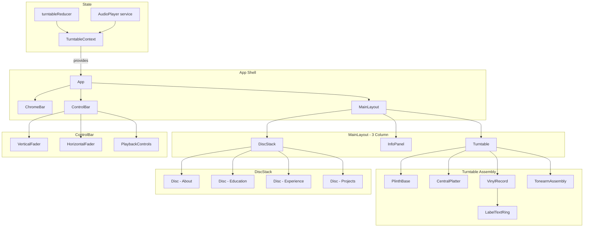

# Design Document: Turntable Portfolio

## Overview

This design describes a single-frame (no-scroll) React + Vite portfolio website built around a turntable/vinyl record metaphor. The application renders a three-column desktop layout (turntable | info panel | disc stack) that collapses to a stacked mobile layout below 768px. Users interact by clicking colored vinyl discs to animate them onto a turntable platter, triggering CSS spin animations, tonearm movement, audio playback, and section content display. The entire UI uses a pixel-art dark mode aesthetic with a Rosea pixel font, 16×16 grid alignment, and a retro browser chrome bar.

The project is greenfield. The tech stack is:
- **React 18+** with functional components and hooks
- **Vite** for build tooling and dev server
- **TypeScript** for type safety
- **CSS Modules** (or vanilla CSS with CSS custom properties) for styling — no CSS-in-JS library needed
- **SVG** for curved label text ring on the vinyl record
- **HTML5 Audio API** for audio playback
- **fast-check** for property-based testing, **Vitest** for unit/integration tests

No external UI framework (e.g., MUI, Tailwind) is used — the pixel-art aesthetic requires hand-crafted styles aligned to the 16×16 grid.

## Architecture

The application follows a component-driven architecture with centralized state management via React Context + useReducer. There is no backend; all data (section content, audio file paths, disc colors) is static and bundled at build time.



### State Flow

1. User clicks a Disc → dispatches `SELECT_DISC` action
2. Reducer updates `activeDiscId`, sets `animationPhase` to `"disc-to-platter"`
3. Animation completes → dispatches `ANIMATION_COMPLETE` → sets `playbackState` to `"playing"`
4. TonearmAssembly reads `playbackState` and animates to playing position
5. AudioPlayer service reacts to `activeDiscId` changes, loads and plays the corresponding track
6. InfoPanel reads `activeDiscId` to render the correct section content

### Responsive Strategy

- CSS Grid with `grid-template-columns: 1fr 2fr 1fr` for desktop (≥768px)
- Single column `grid-template-columns: 1fr` for mobile (<768px) with `grid-template-rows` stacking: Turntable → InfoPanel → DiscStack
- All dimensions use `rem` or `vw/vh` units relative to viewport, ensuring no overflow
- `overflow: hidden` on the root container to enforce single-frame constraint

## Components and Interfaces

### Component Tree

```
<App>
  <TurntableProvider>          // React Context provider
    <ChromeBar />              // Decorative top bar
    <MainLayout>               // CSS Grid container
      <Turntable>              // Left column
        <PlinthBase />         // Wood grain base
        <CentralPlatter />     // Metal platter
        <VinylRecord>          // Spinning disc on platter
          <LabelTextRing />    // SVG curved text
        </VinylRecord>
        <TonearmAssembly />    // Pivoting arm
      </Turntable>
      <InfoPanel />            // Center column — section content
      <DiscStack>              // Right column
        <Disc />               // × 4 (About, Education, Experience, Projects)
      </DiscStack>
    </MainLayout>
    <ControlBar>               // Bottom bar
      <VerticalFader />        // Volume
      <HorizontalFader />      // Effects
      <PlaybackControls />     // Play/Pause/Stop
    </ControlBar>
  </TurntableProvider>
</App>
```

### Key Component Interfaces

```typescript
// --- State Types ---

type SectionId = "about" | "education" | "experience" | "projects";

type PlaybackState = "idle" | "playing" | "paused";

type AnimationPhase =
  | "none"
  | "disc-to-platter"
  | "platter-to-stack"
  | "swap";

interface TurntableState {
  activeDiscId: SectionId | null;
  previousDiscId: SectionId | null;
  playbackState: PlaybackState;
  animationPhase: AnimationPhase;
  volume: number;          // 0–1
  effectLevel: number;     // 0–1
}

// --- Action Types ---

type TurntableAction =
  | { type: "SELECT_DISC"; discId: SectionId }
  | { type: "DESELECT_DISC" }
  | { type: "ANIMATION_COMPLETE" }
  | { type: "SET_PLAYBACK"; state: PlaybackState }
  | { type: "SET_VOLUME"; volume: number }
  | { type: "SET_EFFECT_LEVEL"; level: number }
  | { type: "AUDIO_ERROR"; error: string };

// --- Context ---

interface TurntableContextValue {
  state: TurntableState;
  dispatch: React.Dispatch<TurntableAction>;
}

// --- Component Props ---

interface DiscProps {
  sectionId: SectionId;
  color: string;
  label: string;
  isActive: boolean;
  isMuted: boolean;
  onClick: (sectionId: SectionId) => void;
}

interface VinylRecordProps {
  isSpinning: boolean;
  sectionTitle: string;
  color: string;
}

interface LabelTextRingProps {
  text: string;       // e.g. "INFO - PLAYING: About"
  fontSize: number;   // pixel-grid aligned
}

interface TonearmAssemblyProps {
  state: "parked" | "playing";
  transitionDuration: number; // ms, default 400
}

interface FaderProps {
  orientation: "horizontal" | "vertical";
  value: number;       // 0–1
  onChange: (value: number) => void;
  label: string;
  ariaLabel: string;
}

interface PlaybackControlsProps {
  playbackState: PlaybackState;
  onPlay: () => void;
  onPause: () => void;
  onStop: () => void;
}

interface InfoPanelProps {
  activeSectionId: SectionId | null;
}
```

### AudioPlayer Service

```typescript
interface AudioPlayerService {
  load(sectionId: SectionId): Promise<void>;
  play(): void;
  pause(): void;
  stop(): void;
  setVolume(volume: number): void;  // 0–1
  isPlaying(): boolean;
  onError(callback: (error: string) => void): void;
}
```

This is a plain class (not a React component) instantiated once and accessed via a ref or module singleton. It wraps the HTML5 `Audio` element.

### LabelTextRing — SVG Curved Text

The label text ring uses an SVG `<textPath>` on a circular `<path>` to render curved text around the vinyl center. The SVG is embedded inside the `VinylRecord` component and inherits the CSS spin animation.

```tsx
// Simplified structure
<svg viewBox="0 0 200 200">
  <defs>
    <path id="textCircle" d="M 100,100 m -70,0 a 70,70 0 1,1 140,0 a 70,70 0 1,1 -140,0" />
  </defs>
  <text>
    <textPath href="#textCircle" startOffset="0%">
      INFO - PLAYING: {sectionTitle}
    </textPath>
  </text>
</svg>
```

## Data Models

### Section Content Data

All section content is static and defined in a data module (`src/data/sections.ts`):

```typescript
interface SectionData {
  id: SectionId;
  title: string;
  discColor: string;
  audioSrc: string;
  content: AboutContent | EducationContent | ExperienceContent | ProjectsContent;
}

interface AboutContent {
  type: "about";
  avatar: string;       // image path
  name: string;
  title: string;
  links: { label: string; url: string }[];
  bio: string;
}

interface EducationContent {
  type: "education";
  entries: {
    institution: string;
    degree: string;
    dateRange: string;
  }[];
}

interface ExperienceContent {
  type: "experience";
  entries: {
    company: string;
    role: string;
    description: string;
    dateRange: string;
  }[];
}

interface ProjectsContent {
  type: "projects";
  entries: {
    name: string;
    description: string;
    links: { label: string; url: string }[];
  }[];
}

// Master data array
const SECTIONS: SectionData[] = [
  { id: "about", title: "About", discColor: "#D696B6", audioSrc: "/audio/about.mp3", content: { ... } },
  { id: "education", title: "Education", discColor: "#EC06ED", audioSrc: "/audio/education.mp3", content: { ... } },
  { id: "experience", title: "Experience", discColor: "#0086EC", audioSrc: "/audio/experience.mp3", content: { ... } },
  { id: "projects", title: "Projects", discColor: "#00CFFE", audioSrc: "/audio/projects.mp3", content: { ... } },
];
```

### Design Tokens

```typescript
const TOKENS = {
  colors: {
    background: "#1a1a2e",
    accent1: "#D696B6",
    accent2: "#EC06ED",
    accent3: "#0086EC",
    accent4: "#00CFFE",
    textPrimary: "#DEFFEE",
    textSecondary: "#D0EF8E",
    surface: "#000FF6",
  },
  grid: {
    unit: 16,  // px — base pixel grid
  },
  animation: {
    discToPlatter: 600,   // ms (Req 4.5)
    tonearmTransition: 400, // ms (Req 8.4)
    spinRpm: 33.3,         // revolutions per minute
  },
  font: {
    family: "'Rosea', monospace",
  },
  breakpoints: {
    mobile: 768, // px
  },
  textures: {
    woodGrain: "/textures/dark-wood-grain.png",
    brushedMetal: "/textures/brushed-metal.png",
  },
} as const;
```

### Reducer Logic

```typescript
function turntableReducer(state: TurntableState, action: TurntableAction): TurntableState {
  switch (action.type) {
    case "SELECT_DISC":
      if (state.activeDiscId === action.discId) {
        // Clicking the active disc deselects it
        return { ...state, activeDiscId: null, previousDiscId: state.activeDiscId, playbackState: "idle", animationPhase: "platter-to-stack" };
      }
      if (state.activeDiscId !== null) {
        // Swap: return current disc, then load new one
        return { ...state, previousDiscId: state.activeDiscId, activeDiscId: action.discId, animationPhase: "swap" };
      }
      // No active disc — simple selection
      return { ...state, activeDiscId: action.discId, previousDiscId: null, animationPhase: "disc-to-platter" };

    case "DESELECT_DISC":
      return { ...state, activeDiscId: null, previousDiscId: state.activeDiscId, playbackState: "idle", animationPhase: "platter-to-stack" };

    case "ANIMATION_COMPLETE":
      return { ...state, animationPhase: "none", playbackState: state.activeDiscId ? "playing" : "idle" };

    case "SET_PLAYBACK":
      return { ...state, playbackState: action.state };

    case "SET_VOLUME":
      return { ...state, volume: Math.max(0, Math.min(1, action.volume)) };

    case "SET_EFFECT_LEVEL":
      return { ...state, effectLevel: Math.max(0, Math.min(1, action.level)) };

    case "AUDIO_ERROR":
      // Keep playing state but surface error — handled by ControlBar notification
      return state;

    default:
      return state;
  }
}

const INITIAL_STATE: TurntableState = {
  activeDiscId: null,
  previousDiscId: null,
  playbackState: "idle",
  animationPhase: "none",
  volume: 0.7,
  effectLevel: 0.5,
};
```


## Correctness Properties

*A property is a characteristic or behavior that should hold true across all valid executions of a system — essentially, a formal statement about what the system should do. Properties serve as the bridge between human-readable specifications and machine-verifiable correctness guarantees.*

### Property 1: Layout breakpoint determines column mode

*For any* positive integer viewport width, the layout mode should be `"stacked"` if the width is less than 768, and `"columns"` if the width is 768 or greater. No other layout mode should be possible.

**Validates: Requirements 1.3, 1.4**

### Property 2: Tonearm state follows playback state

*For any* `TurntableState`, the derived tonearm position should be `"parked"` when `playbackState` is `"idle"` or `"paused"`, and `"playing"` when `playbackState` is `"playing"`.

**Validates: Requirements 2.3, 4.3, 8.1, 8.2, 8.3**

### Property 3: Disc visual state derivation

*For any* `TurntableState` and *for any* `SectionId`, the disc's visual state should be: (a) absent from the stack if it equals `activeDiscId`, and (b) muted otherwise. When `activeDiscId` is `null`, all discs should be muted and present.

**Validates: Requirements 3.4, 3.5**

### Property 4: Reducer disc selection logic

*For any* `TurntableState` and *for any* `SELECT_DISC` action with a given `discId`:
- If `activeDiscId` is `null`, the new state should have `activeDiscId` set to `discId` and `animationPhase` set to `"disc-to-platter"`.
- If `activeDiscId` equals `discId` (re-click), the new state should have `activeDiscId` set to `null` and `playbackState` set to `"idle"`.
- If `activeDiscId` is a different section, the new state should have `activeDiscId` set to the new `discId`, `previousDiscId` set to the old active, and `animationPhase` set to `"swap"`.

**Validates: Requirements 4.1, 4.4, 7.3**

### Property 5: Animation complete transitions to playing

*For any* `TurntableState` where `activeDiscId` is not `null`, dispatching `ANIMATION_COMPLETE` should set `playbackState` to `"playing"` and `animationPhase` to `"none"`. When `activeDiscId` is `null`, it should set `playbackState` to `"idle"`.

**Validates: Requirements 4.2**

### Property 6: All disc colors are unique

*For any* pair of distinct sections in the `SECTIONS` data array, their `discColor` values should be different.

**Validates: Requirements 3.2**

### Property 7: Label text formatting

*For any* non-empty section title string, the label text ring formatter should produce a string matching the pattern `"INFO - PLAYING: {title}"` where `{title}` is the exact input title.

**Validates: Requirements 5.1**

### Property 8: Section data lookup consistency

*For any* valid `SectionId`, looking up the section in the `SECTIONS` array should return exactly one entry whose `id` matches the queried `SectionId`, and whose `audioSrc` and `content` fields are defined (non-null, non-empty).

**Validates: Requirements 6.1, 7.1**

### Property 9: Volume and effect level clamping

*For any* numeric value (including negative numbers and numbers greater than 1), dispatching `SET_VOLUME` or `SET_EFFECT_LEVEL` through the reducer should produce a state where `volume` and `effectLevel` are clamped to the range [0, 1].

**Validates: Requirements 9.2, 9.3**

### Property 10: Playback state transitions

*For any* `TurntableState` and *for any* `PlaybackState` value, dispatching `SET_PLAYBACK` should set `playbackState` to the specified value without altering `activeDiscId`, `volume`, or `effectLevel`.

**Validates: Requirements 9.5, 9.6**

### Property 11: Keyboard disc activation parity

*For any* `SectionId`, the keyboard activation handler (Enter or Space on a focused disc) should dispatch the same `SELECT_DISC` action as a mouse click on that disc, producing identical state transitions.

**Validates: Requirements 12.2**

### Property 12: Keyboard fader step adjustment

*For any* current fader value in [0, 1] and *for any* arrow key direction (up/right = increase, down/left = decrease), the resulting fader value should change by a fixed discrete step and remain clamped to [0, 1].

**Validates: Requirements 12.3**

## Error Handling

### Audio Loading Failures (Requirement 7.4)

- The `AudioPlayer` service wraps `audio.play()` in a try/catch and listens for the `error` event on the `HTMLAudioElement`.
- On failure, it dispatches `AUDIO_ERROR` with the error message.
- The reducer does **not** change core state on `AUDIO_ERROR` — playback state, active disc, and animations continue unaffected.
- The `ControlBar` component subscribes to error state and renders a non-blocking toast notification (auto-dismiss after 5 seconds).
- The application remains fully functional without audio.

### Missing Section Data

- If a `SectionId` has no matching entry in `SECTIONS`, the `InfoPanel` falls back to the About section content (same as the default/initial state).
- TypeScript's exhaustive type checking on `SectionId` prevents this at compile time for known sections.

### Invalid Fader Values

- The reducer clamps all fader values to [0, 1] via `Math.max(0, Math.min(1, value))`.
- NaN inputs are handled by defaulting to the current value (a guard in the reducer).

### Animation Interruption

- If a user clicks a new disc while an animation is in progress, the current animation is cancelled (via CSS `animation: none` reset) and the new `SELECT_DISC` action is processed immediately.
- The `animationPhase` state machine prevents conflicting animations.

### Font Loading Failure

- The `@font-face` declaration for Rosea includes a `monospace` fallback.
- The pixel-grid layout does not depend on exact font metrics, so the UI remains functional with the fallback.

## Testing Strategy

### Testing Framework

- **Vitest** for all unit and integration tests
- **fast-check** for property-based testing
- **React Testing Library** for component rendering tests
- **jsdom** environment for DOM-dependent tests

### Unit Tests (Example-Based)

Unit tests cover specific examples, edge cases, and integration points:

- **Initial state**: Verify `INITIAL_STATE` has `activeDiscId: null`, `playbackState: "idle"`, `animationPhase: "none"` (Req 13.1–13.4)
- **Section data completeness**: Verify exactly 4 sections exist with ids "about", "education", "experience", "projects" (Req 3.1)
- **Animation timing tokens**: Verify `discToPlatter === 600` and `tonearmTransition === 400` (Req 4.5, 8.4)
- **Default InfoPanel content**: Verify InfoPanel renders About content when `activeDiscId` is null (Req 6.6, 13.4)
- **Section content structure**: Verify each section type renders its required fields — About (avatar, name, title, links, bio), Education (institution, degree, dateRange), Experience (company, role, description, dateRange), Projects (name, description, links) (Req 6.2–6.5)
- **Audio error resilience**: Verify `AUDIO_ERROR` action does not alter core state (Req 7.4)
- **Tab navigation**: Verify all interactive elements (Discs, faders, playback controls) have appropriate `tabIndex` and `role` attributes (Req 12.1)
- **Focus indicator**: Verify focus styles are applied to interactive elements (Req 12.4)
- **ControlBar structure**: Verify at least one horizontal and one vertical fader render (Req 9.1)

### Property-Based Tests

Each property test uses **fast-check** with a minimum of **100 iterations**. Each test is tagged with a comment referencing the design property.

```
// Feature: turntable-portfolio, Property 1: Layout breakpoint determines column mode
// Feature: turntable-portfolio, Property 2: Tonearm state follows playback state
// Feature: turntable-portfolio, Property 3: Disc visual state derivation
// Feature: turntable-portfolio, Property 4: Reducer disc selection logic
// Feature: turntable-portfolio, Property 5: Animation complete transitions to playing
// Feature: turntable-portfolio, Property 6: All disc colors are unique
// Feature: turntable-portfolio, Property 7: Label text formatting
// Feature: turntable-portfolio, Property 8: Section data lookup consistency
// Feature: turntable-portfolio, Property 9: Volume and effect level clamping
// Feature: turntable-portfolio, Property 10: Playback state transitions
// Feature: turntable-portfolio, Property 11: Keyboard disc activation parity
// Feature: turntable-portfolio, Property 12: Keyboard fader step adjustment
```

**Generators needed:**
- `arbitrarySectionId`: generates one of `"about" | "education" | "experience" | "projects"`
- `arbitraryTurntableState`: generates a valid `TurntableState` with random `activeDiscId`, `playbackState`, `animationPhase`, `volume` (0–1), `effectLevel` (0–1)
- `arbitraryViewportWidth`: generates positive integers (1–4000)
- `arbitraryFaderValue`: generates floats in [0, 1]
- `arbitraryNumericValue`: generates arbitrary floats (including negatives and >1) for clamping tests
- `arbitrarySectionTitle`: generates non-empty strings for label formatting tests

Each correctness property (1–12) maps to exactly one property-based test. Unit tests and property tests together provide comprehensive coverage — unit tests catch concrete bugs and verify specific examples, while property tests verify universal correctness across all valid inputs.
